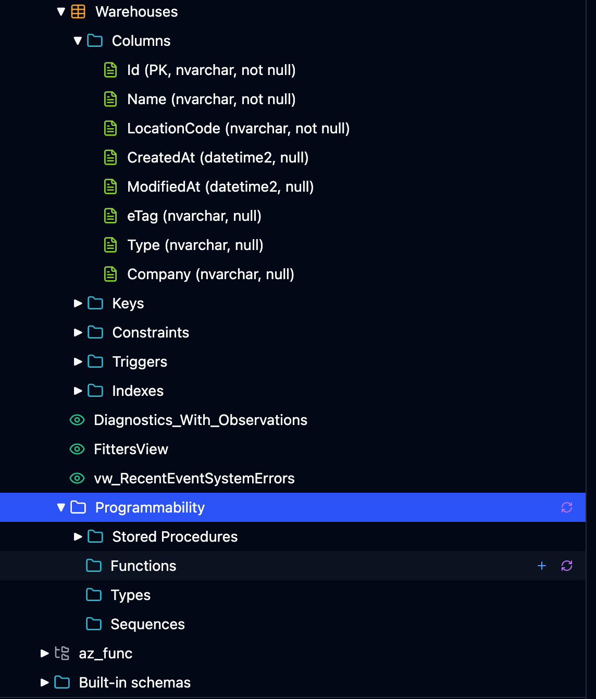
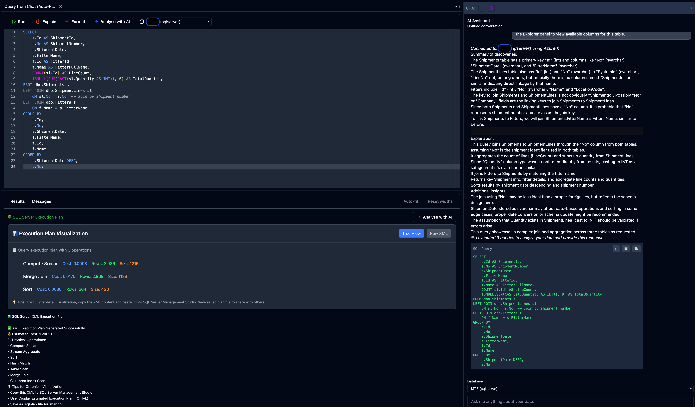
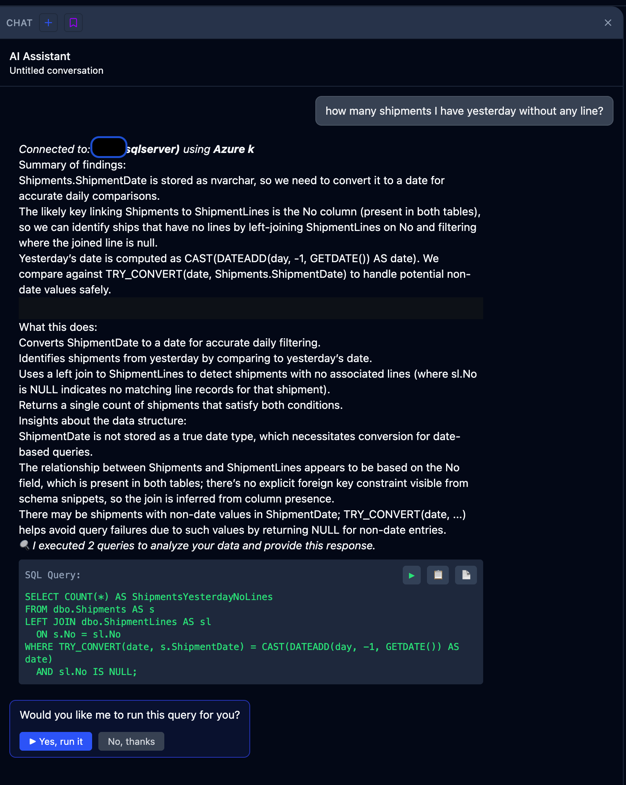
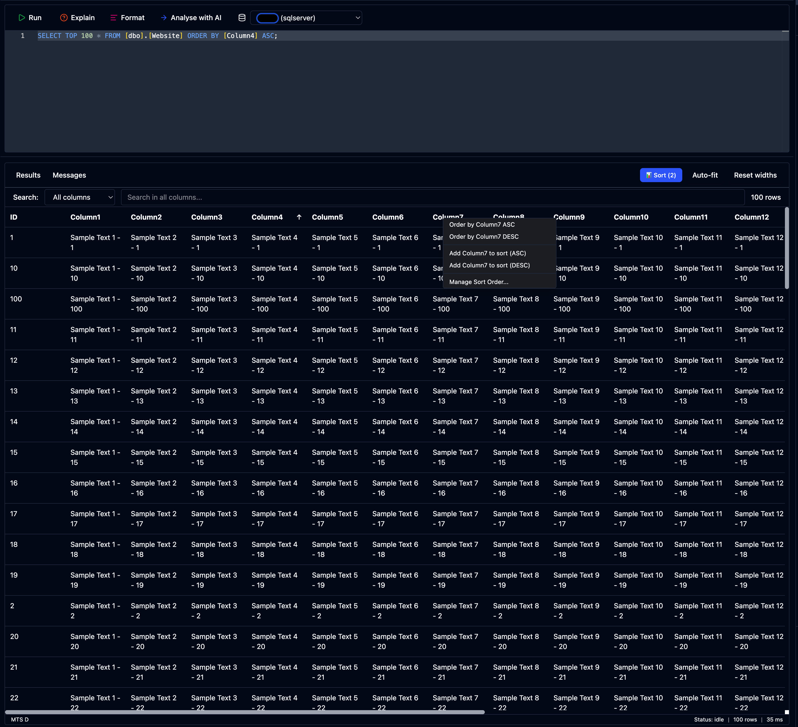

<p align="center">
  
</p>

<h1 align="center">LuceData</h1>

<p align="center">
  <strong>The open-source, AI-powered SQL desktop client.</strong><br />
  One app. Any database. Any AI engine.
</p>

<p align="center">
  <a href="https://github.com/victorZKov/lucedata/blob/main/LICENSE"></a>
  <a href="https://github.com/victorZKov/lucedata/issues"></a>
  <a href="https://github.com/victorZKov/lucedata/stargazers"></a>
  <a href="https://buymeacoffee.com/victorxata"></a>
</p>

---

## What is LuceData?

LuceData is a cross-platform desktop application for managing SQL databases with built-in AI assistance. Connect to **SQL Server**, **PostgreSQL**, or **SQLite**, and use **OpenAI**, **Azure OpenAI**, **Claude**, **Gemini**, or a **local Ollama** model to generate SQL, explain queries, optimize execution plans, and explore your schema — all from a single app.

Built with **Electron**, **React 19**, **TypeScript**, and **Vite**.

## Key Features

| Feature | Description |
|---|---|
| **Bring Your Own Model** | Connect any AI provider — OpenAI, Azure, Anthropic, Google, Ollama, or custom endpoints. |
| **Multi-Database Support** | SQL Server, PostgreSQL, and SQLite out of the box. Oracle and MySQL coming soon. |
| **Monaco SQL Editor** | Full-featured editor with syntax highlighting, autocomplete, formatting, and split views. |
| **AI Chat Assistant** | Ask questions in plain English, get SQL back — grounded in your actual schema. |
| **Visual Schema Explorer** | Navigate servers, databases, tables, columns, keys, indexes, and triggers in a tree view. |
| **Results Grid** | Resizable columns, filtering, sorting, and one-click CSV export. |
| **Security Guardrails** | Read-only by default. AI-generated SQL requires explicit user approval. Dangerous operations are blocked with configurable allowlists. |
| **Cross-Platform** | Runs on macOS, Windows, and Linux. |
| **Dark & Light Themes** | System-aware theme switching. |
| **Secure Credential Storage** | Passwords stored in the OS keychain (macOS Keychain, Windows Credential Vault, libsecret on Linux). |

## Quick Start

```bash
# Clone the repository
git clone https://github.com/victorZKov/lucedata.git
cd lucedata

# Install dependencies
pnpm install

# Start the desktop app in development mode
./scripts/dev.sh

# Or start the product website
./scripts/runwebsite.sh
```

### Prerequisites

- **Node.js** 18+
- **pnpm** 8+
- **Git**

## Architecture

This is a monorepo managed with **pnpm workspaces** and **Turborepo**:

```
lucedata/
  apps/
    desktop/           # Electron main process (IPC, windows, auto-update)
    renderer/          # React UI (Vite, Tailwind, Monaco Editor)
  packages/
    ai-integration/    # AI provider abstraction (OpenAI, Azure, Ollama, MCP tools)
    database-core/     # Database abstraction (SQL Server, PostgreSQL, SQLite providers)
    security-guardrails/ # SQL analysis, audit logging, execution safety
    storage/           # Local storage (SQLite + Drizzle ORM, OS keychain credentials)
  website/             # Next.js product & docs website
  scripts/             # Build, dev, and deployment scripts
  docs/                # Technical documentation
```

## Available Scripts

| Command | Description |
|---|---|
| `./scripts/dev.sh` | Start desktop app in dev mode (Electron + Vite) |
| `./scripts/dev.sh prod` | Build and run in production mode |
| `./scripts/runwebsite.sh` | Start the Next.js website (port 3000) |
| `./scripts/build-mac.sh` | Build macOS distributable |
| `./scripts/build-windows.sh` | Build Windows distributable |
| `pnpm build` | Build all packages |
| `pnpm lint` | Lint all code |
| `pnpm type-check` | TypeScript type checking |
| `pnpm format` | Format code with Prettier |

## Security & Privacy

LuceData takes security seriously:

- **Read-only by default** — AI-generated SQL requires explicit user action to execute.
- **Guardrails** — `DROP`, `TRUNCATE`, `DELETE` without `WHERE`, and other dangerous operations are blocked unless explicitly allowed.
- **Credential isolation** — Database passwords are stored in the OS keychain, never in plain text.
- **Audit trail** — All SQL executions are logged with hashed queries for traceability.
- **No telemetry** — Your data stays on your machine. No analytics, no tracking, no phone-home.

## Screenshots

<table>
  <tr>
    <td align="center"><br /><sub>Monaco SQL Editor</sub></td>
    <td align="center"><br /><sub>AI Chat Assistant</sub></td>
  </tr>
  <tr>
    <td align="center"><br /><sub>Schema Explorer</sub></td>
    <td align="center"><br /><sub>Results Grid</sub></td>
  </tr>
</table>

## Roadmap

- [ ] Oracle & MySQL support
- [ ] Advanced schema migrations and versioning
- [ ] Export to Excel, JSON, Parquet
- [ ] Team collaboration — shared snippets and workspaces
- [ ] Plugin system for custom AI tools

See the full roadmap on the [website](https://lucedata.com) or [open an issue](https://github.com/victorZKov/lucedata/issues) to suggest a feature.

## Contributing

We welcome contributions! Please see [CONTRIBUTING.md](CONTRIBUTING.md) for guidelines on:

- Setting up the development environment
- Commit message conventions (Conventional Commits)
- Project structure and code style
- Submitting pull requests

## Support the Project

If you find LuceData useful, consider supporting its development:

<a href="https://buymeacoffee.com/victorxata" target="_blank"></a>

## License

This project is licensed under the **MIT License** — see the [LICENSE](LICENSE) file for details.
